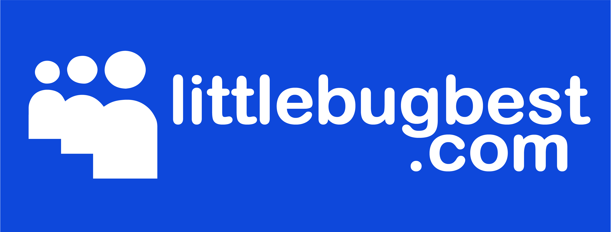

```
About Me                                                     /\_______/\
 │                                                     ___  /           \    _
 ├─── Howdy!                                          │ooo│ │   ^   ^   │   │ │
 │    │                                                \o0\ \  // ▼ \\  /   │ │
 │    └─── I'm Aloe (they/them)                         \  \_\         /    │ │
 │             │                                         \              \  / /
 │             ├─── I'm a Software Developer              \            │ │ │ │
 │             │             │                             │           │ │_│ │
 │             │             └───── I <3 Frontend / Mobile 
 │             │    
 │             └── I'm an artist, a climber, an innovator
 ├─── Where?          
 │     │
 │     └───── Portland, Oregon
 │
 └─── Technologies I work with lately?
                │
                └────── Javascript, HTML/CSS, React, React Native, Nextjs
                        Node, Express, MongoDB, PostgreSQL, Git
                        Illustrator, Photoshop, Canva, Figma
```


<table width="100%" align="center">
<tr>
<td align="center">
<a href="https://littlebugbest.com">
<strong>Check out my portfolio </strong>
<br />
<br />
<div align="center">

<br>
</h3> 
</div>

</td>


<td align="center">
<a href="https://linkedin.com/in/aloenelson">
<strong>Connect with me</strong>
<br />
<br />


<p>
 
</a>
</p>

</td>
</tr>
</table>
<br>

<div align="center">
<h2>✨ Current project is an e-commerce site for utilizing Nextjs and Medusajs ✨</h2>
</div>


